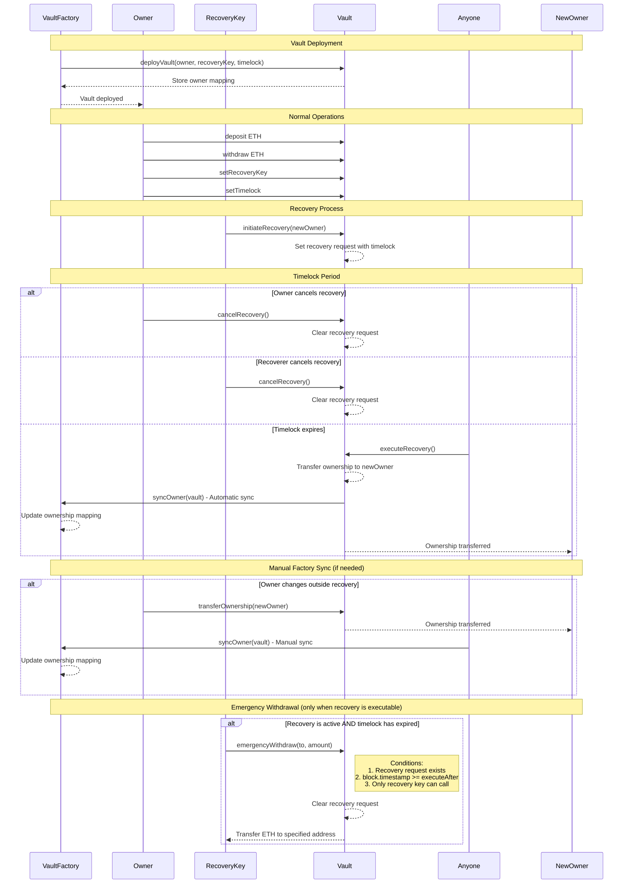

# Demo Recovery Contracts

This project demonstrates a time-locked recovery system for Ethereum vaults, allowing designated recovery keys to 
initiate ownership transfers after a configurable timelock period.

## Recovery Flow



## Development

#### Compilation

To compile the contracts, use the next script:

```bash
npm run compile
```

#### Test

To run the tests, execute the following command:

```bash
npm run test
```

Or to see the coverage, run:

```bash
npm run coverage
```

#### Local deployment

To deploy the contracts locally, run the following commands (in the different terminals):

```bash
npm run private-network
npm run deploy-localhost
```

#### Bindings

The command to generate the bindings is as follows:

```bash
npm run generate-types
```

> See the full list of available commands in the `package.json` file.

